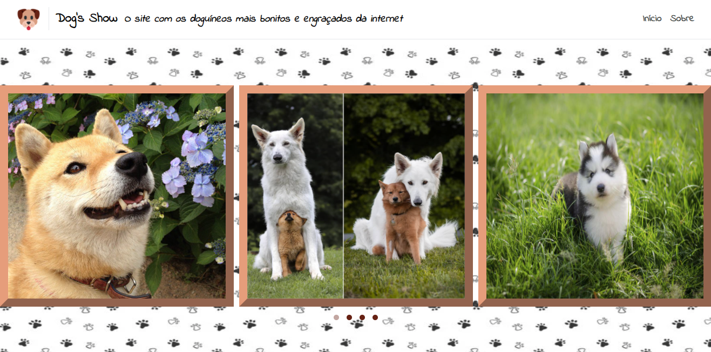
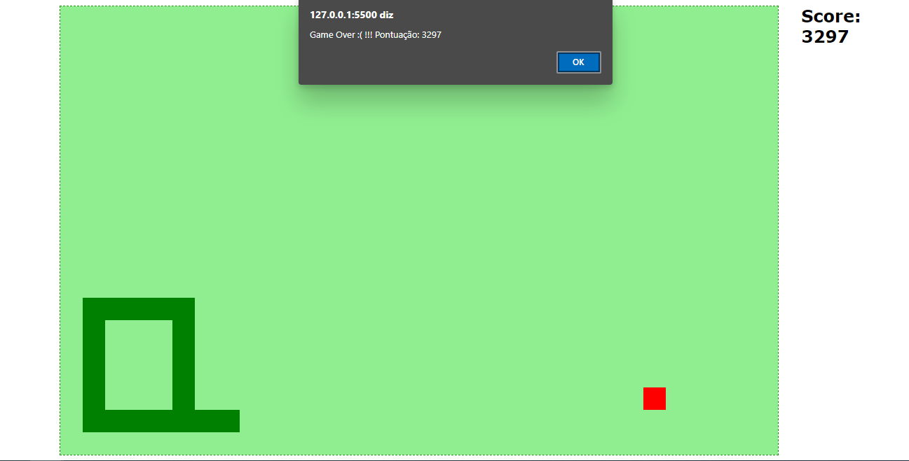

# Digital Innovation One

Repositório para projetos criados através dos cursos da plataforma de ensino da Digital Innovation One

#

# Resultado da recriação da página do instagram : <a href="https://github.com/lucian-af/digital-innovation-one/tree/main/recriando-home-instagran" target="_blank">(repo)</a>

#

# Resultado para o desafio de recriação da interface da Netflix : <a href="https://github.com/lucian-af/digital-innovation-one/tree/main/recriando-home-netflix" target="_blank">(repo)</a>

Usei somente a idéia do carrossel e criei algo diferente uma espécie de álbum de fotos

#

# Resultado para o desafio de recriação do jogo da cobrinha (Snake) : <a href="https://github.com/lucian-af/digital-innovation-one/tree/main/recriando-jogo-cobrinha" target="_blank">(repo)</a>

